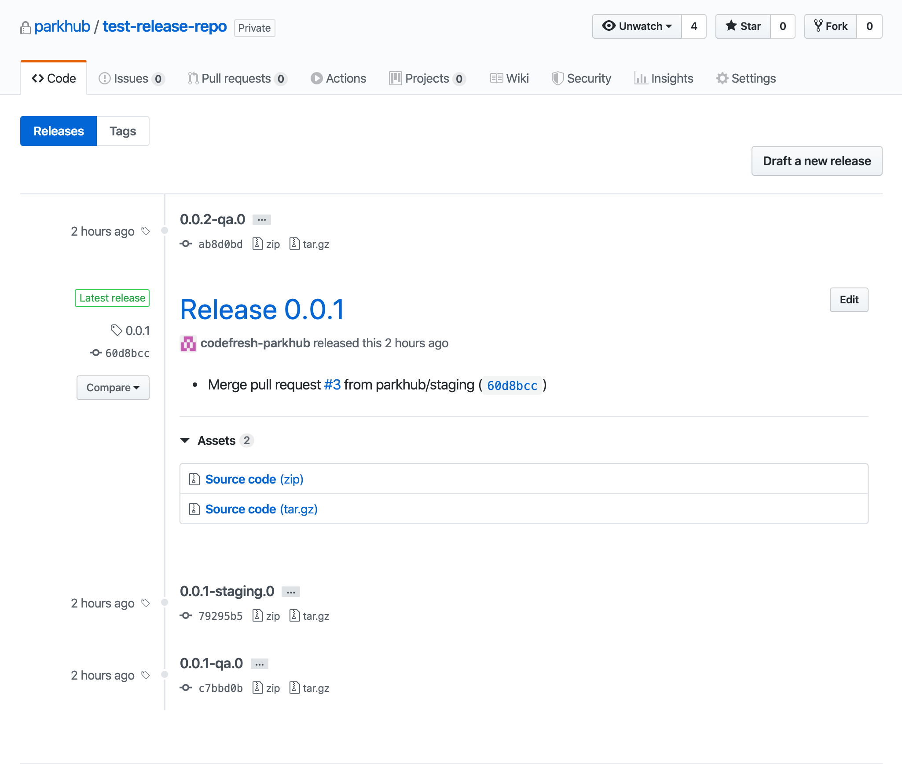

# Automated Release Versioning

We use release-it to automate creating pre-release tags and official releases for each of our micro-services.  Each folder is a related build step for the environment it is building for.  Below I describe each build script and how we use them in our pipelines.

Each script includes a .release-it.json configuration file that is used to configure what type of release and or tag we want to create.  Please review this repo for more information.

Release-it Repo: https://github.com/release-it/release-it

# Folders

## Production
**after.sh**

Merges the master branch back into develop and qa for the next release after a successful production deployment.

**before.sh**

Prepares the release by checking out the master branch on the repo to create a tag from.

**run.sh**

Runs the release-it command which produces an official release for the repo.

---
## Staging

**before.sh**

Prepares the release by checking out the staging branch on the repo to create a pre-release tag from.

**run.sh**

Runs the release-it command which produces an release candidate pre-release tag for the repo.

---
## QA

**before.sh**

Prepares the release by checking out the qa branch on the repo to create a pre-release tag from.

**run.sh**

Runs the release-it command which produces an pre-release tag for the repo.

# Example

